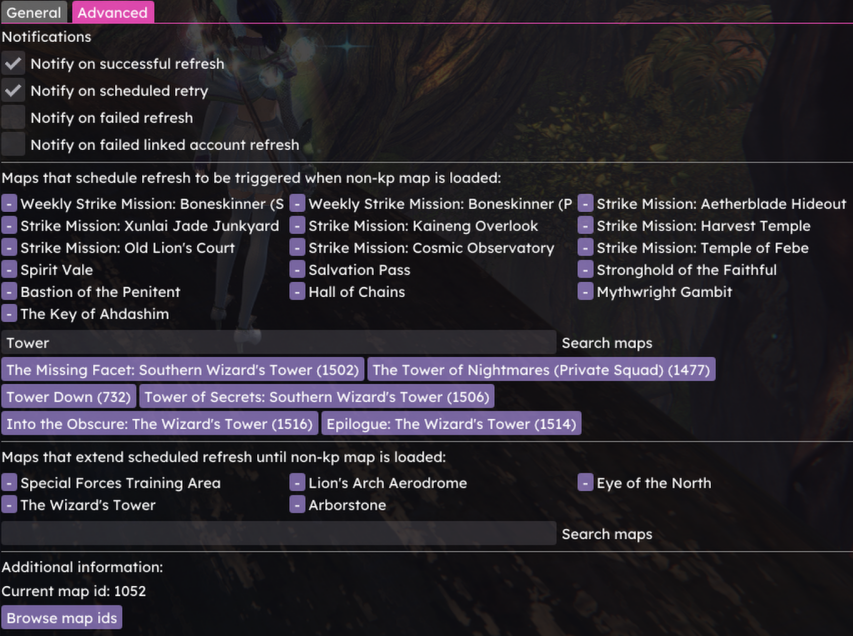

# KP Sync
Killproof synchronizer for Nexus.

## Features
- Automatically refresh kp.me when exiting a raid / strike map (customizable map list),
- Extend scheduled refresh on specific maps to reduce refresh frequency (customizable map list),
- Reattempt refresh on schedule if refresh failed due to KP refresh rate limit,
- Reattempt refresh on Guild Wars 2 start if the game was closed before the scheduled refresh succeeded,
- Linked account support
- Notification options,
- Quick access menu (access by right-clicking the nexus icon),
- Automatic Account name detection (RealtimeAPI / ArcDPS required)

## Installation
1. Install the [Nexus](https://github.com/RaidcoreGG/Nexus) addon manager ([website](https://raidcore.gg/Nexus)).
2. Download [`kp_sync.dll`](../../releases/latest) and place it in your `addons` folder (e.g. `C:\Program Files\Guild Wars 2\addons`).
3. Open the Nexus addon window, click on the refresh button if necessary and load KP Sync.
4. Enter your Killproof ID or account name in addon settings, or enable autodetection via supported addons.

## Screenshots
**Options (General)**

**Options (Advanced)**

**Quick Access menu**

**Notification**

## Credits
- to https://raidcore.gg/, for developing Nexus,
- to https://killproof.me/, for developing KP,
- to [Zerthox](https://github.com/zerthox), for nexus and mumble rust bindings.